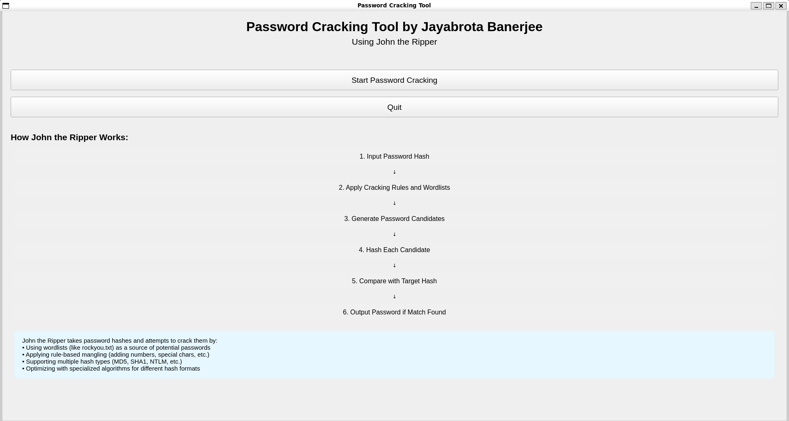
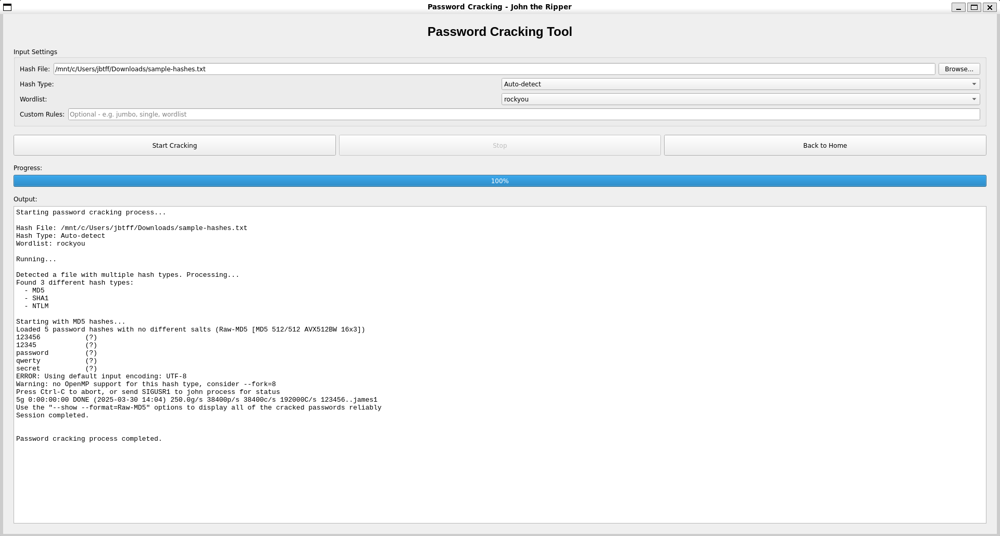

# Password Cracking Tool

A GUI-based password cracking tool using John the Ripper created by Jayabrota Banerjee.

## Features

- User-friendly graphical interface
- Integration with John the Ripper for password cracking
- Support for various hash types (MD5, SHA1, SHA256, NTLM, etc.)
- Built-in access to popular wordlists (rockyou.txt, SecLists)
- Optional Hashcat integration for improved performance
- Visual explanation of the password cracking process
- Progress tracking and detailed output

## Requirements

- Python 3.6+
- PyQt5
- John the Ripper (must be installed and available in PATH)
- Hashcat (optional)

## Installation

1. Install the required Python packages:
   ```
   pip install PyQt5 requests
   ```

2. Install John the Ripper:
   - **Windows**: Download from https://www.openwall.com/john/ and add to PATH
   - **Linux**: `sudo apt-get install john` or equivalent for your distribution
   - **macOS**: `brew install john`

3. (Optional) Install Hashcat for improved performance:
   - **Windows**: Download from https://hashcat.net/hashcat/ and add to PATH
   - **Linux**: `sudo apt-get install hashcat` or equivalent
   - **macOS**: `brew install hashcat`

## Usage

1. Run the application:
   ```
   python main.py
   ```

2. From the homepage, click "Start Password Cracking"

3. In the cracking interface:
   - Select your hash file containing password hashes
   - Choose the hash type (or leave as Auto-detect)
   - Select a wordlist (rockyou, seclists, or custom)
   - Add any custom rules if needed
   - Click "Start Cracking"

4. Monitor progress# Password Cracking Tool

A GUI-based password cracking tool using John the Ripper created by Jayabrota Banerjee.

## Features

- User-friendly graphical interface
- Integration with John the Ripper for password cracking
- Support for various hash types (MD5, SHA1, SHA256, NTLM, etc.)
- Built-in access to popular wordlists (rockyou.txt, SecLists)
- Optional Hashcat integration for improved performance
- Visual explanation of the password cracking process
- Progress tracking and detailed output

## Requirements

- Python 3.6+
- PyQt5
- John the Ripper (must be installed and available in PATH)
- Hashcat (optional)

## Installation

1. Install the required Python packages:
   ```
   pip install PyQt5 requests
   ```

2. Install John the Ripper:
   - **Windows**: Download from https://www.openwall.com/john/ and add to PATH
   - **Linux**: `sudo apt-get install john` or equivalent for your distribution
   - **macOS**: `brew install john`

3. (Optional) Install Hashcat for improved performance:
   - **Windows**: Download from https://hashcat.net/hashcat/ and add to PATH
   - **Linux**: `sudo apt-get install hashcat` or equivalent
   - **macOS**: `brew install hashcat`

## Usage

1. Run the application:
   ```
   python main.py
   ```

2. From the homepage, click "Start Password Cracking"

3. In the cracking interface:
   - Select your hash file containing password hashes
   - Choose the hash type (or leave as Auto-detect)
   - Select a wordlist (rockyou, seclists, or custom)
   - Add any custom rules if needed
   - Click "Start Cracking"

4. Monitor progress
   ## Screenshots
   


